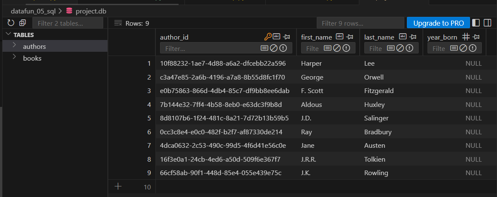
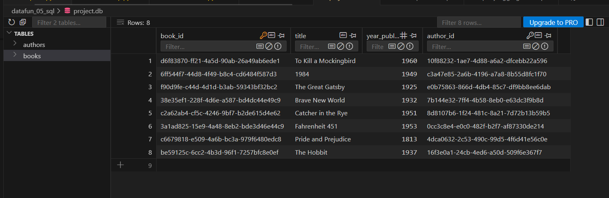

# datafun_05_sql
This project focuses on building and managing a relational database using Python and SQL, with SQLite as the database management system. The project will utilize Python to create, manage, and interact with the database and its tables, leveraging SQL for querying and manipulating relational data.

## Setup Steps

## Common Git Commands

```powershell
git add .
git commit -m "message to describe recent work"
```

This setup provides a clean starting point for developing Python scripts and managing dependencies for database projects.

### 1. Setup Steps (Precursor)
- Created a new repository on GitHub
- Cloned the repository to VS Code using `git clone`
- Added a `.gitignore` file to exclude unnecessary files
- Added a `requirements.txt` file for dependencies
- Installed and upgraded pip, setuptools, and wheel with: `py -m pip install --upgrade pip setuptools wheel`
- Installed project dependencies with: `py -m pip install -r requirements.txt`
- Created a `README.md` file for documentation
- Set up a virtual environment with `py -m venv .venv`
- Activated the virtual environment with `.\.venv\Scripts\activate`

---

## Project 5 Lesson Summary & Steps

This project demonstrates all major skills for working with databases, tables, and records in Python and SQL (SQLite). Below are the itemized steps completed:

### 2. Database & Table Setup
- Created a new SQLite database using Python (`create_db.py`).
- Defined two related tables: `authors` and `books`.
- Automated table creation using SQL scripts (`01_drop_tables.sql`, `02_create_tables.sql`).
- Populated tables with sample data using `03_insert_records.sql` and CSV import scripts.

## Screenshots





### 3. Record Operations
- Inserted records with SQL `INSERT INTO` and Python pandas.
- Read records using SQL `SELECT` statements.
- Filtered records with `WHERE`, including `AND`, `OR`, and `DISTINCT` examples.
- Sorted records with `ORDER BY`.
- Used `INNER JOIN` to combine data from `authors` and `books`.
- Updated records with SQL `UPDATE` statements.
- Deleted records with SQL `DELETE FROM` statements.
- Performed aggregation queries: `COUNT`, `AVG`, `SUM`, and `GROUP BY`.

### 4. Query Examples
- Created example SQL query files for each major concept:
  - `query_aggregation.sql`: Aggregation (COUNT books per author)
  - `query_filter.sql`: Filtering (books published after 1950)
  - `query_group_by.sql`: Grouping (books by year)
  - `query_join.sql`: Joining (books with author names)
  - `query_sorting.sql`: Sorting (authors by last name)
 
 ### 5. Python Integration
 - Used Python scripts to automate running SQL files and importing data.
 - Verified database contents and table relationships with Python queries.
 - Refactored code for clarity and maintainability.
 
 ### 6. Version Control
 - Committed and pushed all changes to GitHub using standard git commands:
	 ```powershell
	 git add .
	 git commit -m "Update SQL query examples and restore drop tables"
	 git push
	 ```
 
 ### 7. Documentation & Best Practices
 - Documented all steps and code in this README for clarity.
 - Followed project specification and textbook guidance (see Project 5 spec and Chapter 17.2 SQL).
 - Practiced using online SQL editors and AI assistance for expressive queries.
 
 ---
 
 This README summarizes all major steps and skills demonstrated in the lesson, providing clear examples and documentation for your instructor.
This setup provides a clean starting point for developing Python scripts and managing dependencies for database projects.