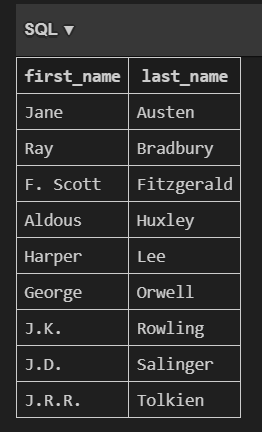

# datafun_05_sql
This project focuses on building and managing a relational database using Python and SQL, with SQLite as the database management system. The project will utilize Python to create, manage, and interact with the database and its tables, leveraging SQL for querying and manipulating relational data.

## 🗂️ Project Structure

Below is an overview of the files and folders in this project. This structure helps organize SQL scripts, data files, images, and Python code for easy navigation and maintenance.

```
datafun_05_sql/
│
├── data/
│   ├── authors.csv
│   ├── books.csv
│   ├── nutrition_values.csv
│   └── produce.csv
│
├── images/
│   ├── aggregation.png
│   ├── python_db01.png
│   ├── python_db02.png
│   └── python_db03.png
│
├── sql_create/
│   ├── 01_drop_tables.sql
│   ├── 02_create_tables.sql
│   └── 03_insert_records.sql
│
├── sql_features/
│   ├── delete_records.sql
│   └── update_records.sql
│
├── sql_queries/
│   ├── query_aggregation.sql
│   ├── query_filter.sql
│   ├── query_group_by.sql
│   ├── query_join.sql
│   └── query_sorting.sql
│
├── db01_setup.py
├── db02_features.py
├── db03_queries.py
├── README.md
├── requirements.txt
├── project.db
└── project.sqlite3
```


## ⚙️ Setup Steps

This setup provides a clean starting point for developing Python scripts and managing dependencies for database projects.

### 1. Setup Steps (Precursor)
- Created a new repository on GitHub
- Cloned the repository to VS Code using `git clone`
- Added a `.gitignore` file to exclude unnecessary files
- Added a `requirements.txt` file for dependencies
- Installed and upgraded pip, setuptools, and wheel with: `py -m pip install --upgrade pip setuptools wheel`
- Installed project dependencies with: `py -m pip install -r requirements.txt`
- Created a `README.md` file for documentation
- Set up a virtual environment with `py -m venv .venv`
- Activated the virtual environment with `.\.venv\Scripts\activate`
- Use the Git commands
  
  ## Common Git Commands

```powershell
git add .
git commit -m "message to describe recent work"
git push
```

---

## 📚 Project 5 Lesson Summary & Steps

This project demonstrates all major skills for working with databases, tables, and records in Python and SQL (SQLite). Below are the itemized steps completed:

### 🗄️ Database & Table Setup
- Created a new SQLite database using Python (`create_db.py`).
- Defined two related tables: `authors` and `books`.
- Automated table creation using SQL scripts (`01_drop_tables.sql`, `02_create_tables.sql`).
- Populated tables with sample data using `03_insert_records.sql` and CSV import scripts.

*This shows the creation of the Author Table and it's corresponding data inputted*


*This shows the creation of the Books Table and it's corresponding data inputted*


### 📋 Record Operations
- Inserted records with SQL `INSERT INTO` and Python pandas.
- Read records using SQL `SELECT` statements.
- Filtered records with `WHERE`, including `AND`, `OR`, and `DISTINCT` examples.
- Sorted records with `ORDER BY`.
- Used `INNER JOIN` to combine data from `authors` and `books`.
- Updated records with SQL `UPDATE` statements.
- Deleted records with SQL `DELETE FROM` statements.
- Performed aggregation queries: `COUNT`, `AVG`, `SUM`, and `GROUP BY`.
  
*Delete sql command-This shows our Authors Table missing 3 books: '1984', 'Pride and Prejudice', 'Fahrenheit 451'*


*Insert sql command-This shows our Authors Table inserting the wrong last name 'Rolling' for 'Rowling'*


### 🔍 Query Examples

- Created example SQL query files for each major concept:
	- `query_aggregation.sql`: Aggregation (COUNT books per author)
	- `query_filter.sql`: Filtering (books published after 1950)
	- `query_group_by.sql`: Grouping (books by year)
	- `query_join.sql`: Joining (books with author names)
	- `query_sorting.sql`: Sorting (authors by last name)
  

*Aggregation Query-Table meaning: Each author only authored 1 book*


*Filter Query-Table result: 3 books were published after 1950: To Kill a Mockingbird, Catcher in the Rye, and Fahrenheit 451*


*Group Query-Table result: For each of these years, only 1 book was published*


*Join Query-Table result: Name of books with authors first and last names*


*Sorting Query-Table result: Authors ordered alphabetically by last name.*



 

### 🐍 Python Integration
- Used Python scripts to automate running SQL files and importing data.
- Verified database contents and table relationships with Python queries.
- Refactored code for clarity and maintainability.


*Python setup*


*Python features*


*Python queries*


 
### 📝 Documentation & Best Practices
 - Documented all steps and code in this README for clarity.
 - Followed project specification and textbook guidance.
 - Practiced using online SQL editors and AI assistance for expressive queries.


This datafun_05_sql project demonstrates the fundamentals of relational database design, management, and integration using Python and SQL (SQLite). The project covers schema creation, table setup, record operations, and advanced querying techniques. Through organized scripts and clear documentation, it showcases how to automate database tasks, maintain data integrity, and visualize results. The structure and examples provided make it easy to understand, extend, and apply these concepts to future data projects.
 
 ---
 
 